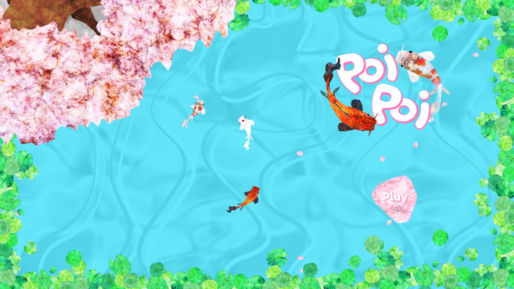
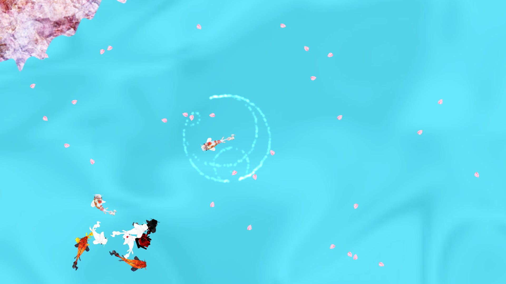
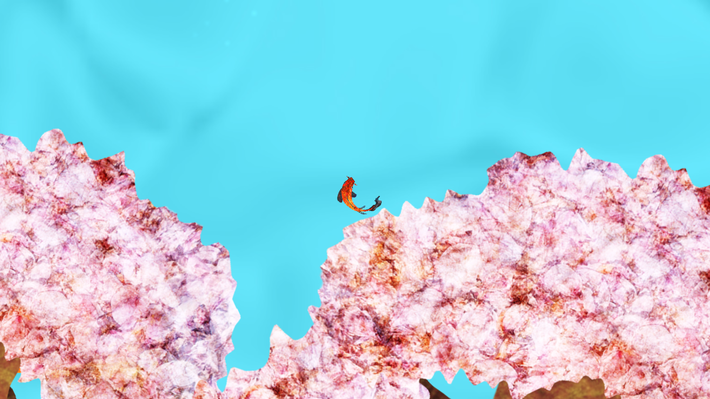

# Poi Poi Game (currently in development)

Single player koi pond game. Inspired by the koi ponds in Japan.  Relaxing art and environment coupled with smooth gameplay.  Complete quests, collect things and explore.  There is lots to see and find within the koi pond ranging from other animals to secret shrines.  

## Built With

* [Unity](https://unity.com/) - game engine
* [Visual Studios](https://visualstudio.microsoft.com/) - IDE

## Authors

* **Elliott Black** - *Design and development* 
* **Danielle Hofstetter** - *Art director* 

